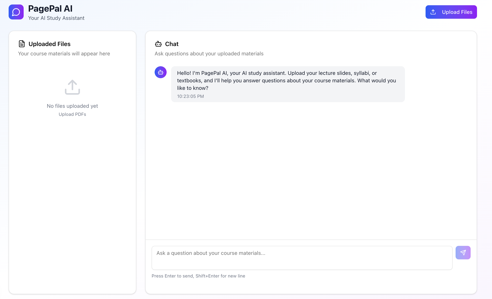
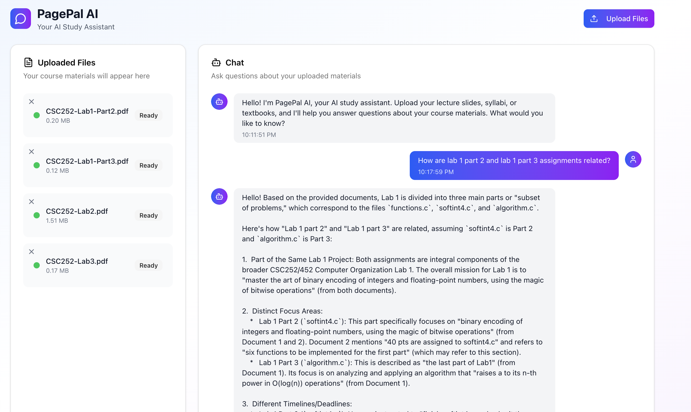

# PagePal AI - AI-Powered Study Assistant

A full-stack RAG (Retrieval-Augmented Generation) application that allows students to upload PDFs of course materials (lecture slides, syllabi, textbooks, assignments) and ask questions about them using AI.





## 🚀 Features

- **PDF Upload & Processing**: Upload multiple PDF files for analysis
- **AI-Powered Q&A**: Ask questions about your course materials
- **Conversational Interface**: Chat-like experience with your documents
- **Real-time Processing**: Instant document processing and querying
- **Beautiful UI**: Modern interface built with Next.js and Shadcn/ui
- **File Management**: Upload, delete, and manage your course materials

## 🏗️ Architecture

- **Frontend**: Next.js 15 with TypeScript, Tailwind CSS, Shadcn/ui
- **Backend**: Python FastAPI service
- **AI/ML**: Google Gemini 2.5 Flash LLM, RAG
- **Vector Database**: Pinecone for document embeddings
- **Document Processing**: LangChain for text extraction and chunking

## 📋 Prerequisites

- Node.js 18+ 
- Python 3.8+
- Pinecone account (free tier available)
- Google AI Studio account (free tier available)

## 🗄️ Pinecone Setup

### 1. Create Pinecone Account
1. Go to [Pinecone Console](https://app.pinecone.io/)
2. Sign up for a free account
3. Get your API key and environment from the console

### 2. Create Your Index
1. In Pinecone Console, click "Create Index"
2. **Index Name**: Choose a unique name (e.g., "pagepal-docs")
3. **Dimensions**: 768 (for the embedding model we use)
4. **Metric**: Cosine
5. **Cloud**: Choose your preferred region
6. Click "Create Index"

## ��️ Installation

### 1. Clone the Repository
```bash
git clone https://github.com/yourusername/pagepal-ai.git
cd pagepal-ai
```

### 2. Frontend Setup
```bash
cd frontend
npm install
```

### 3. Backend Setup
```bash
cd backend/python-service
python -m venv venv
source venv/bin/activate  # On Windows: venv\Scripts\activate
pip install -r requirements.txt
```

### 4. Environment Configuration

**Backend (.env):**
```bash
cd backend/python-service
cp .env.example .env
# Edit .env with your API keys
```

**Frontend (.env.local):**
```bash
cd frontend
cp .env.example .env.local
# Edit .env.local if needed
```

## 🔑 Environment Variables

### Backend (.env)
- `PINECONE_API_KEY`: Your Pinecone API key
- `PINECONE_INDEX_NAME`: Your Pinecone index name (e.g., "pagepal-docs")
- `GEMINI_API_KEY`: Your Google AI Studio API key

### Frontend (.env.local)
- `NEXT_PUBLIC_API_URL`: Backend API URL (default: http://localhost:8000)

## 🚀 Running the Application

### 1. Start Backend Service
```bash
cd backend/python-service
source venv/bin/activate  # On Windows: venv\Scripts\activate
python rag_service.py
```
Backend will run on: http://localhost:8000

### 2. Start Frontend
```bash
cd frontend
npm run dev
```
Frontend will run on: http://localhost:3000

### 3. Use the Application
1. Open http://localhost:3000
2. Upload your PDF files (lecture slides, syllabi, etc.)
3. Wait for processing to complete
4. Start asking questions about your materials!

## �� API Endpoints

- `POST /process-pdf`: Upload and process PDF files
- `POST /query`: Ask questions about uploaded documents
- `DELETE /delete-file/{file_name}`: Delete file chunks from database
- `GET /health`: Health check endpoint

# 📝 License

This project is licensed under the MIT License - see the [LICENSE](LICENSE) file for details.

## �� Acknowledgments

- Built with [Next.js](https://nextjs.org/)
- UI components from [Shadcn/ui](https://ui.shadcn.com/)
- AI powered by [Google Gemini](https://ai.google.dev/)
- Vector database by [Pinecone](https://www.pinecone.io/)
